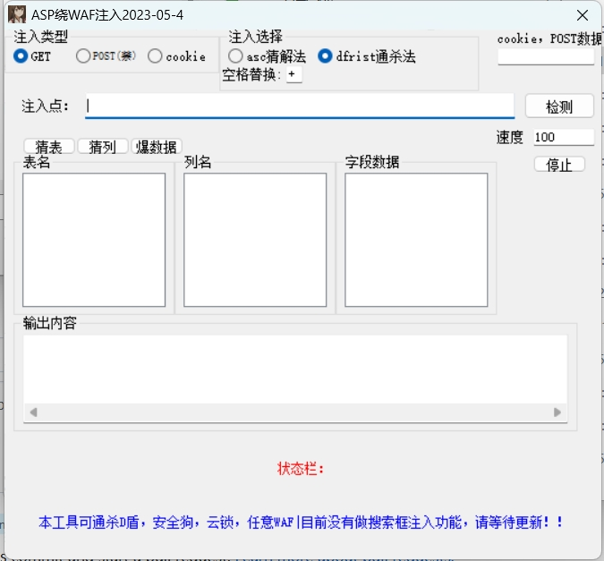

\# Access数据库注入绕过 （通杀所有杀软防火墙）

基于易语言编写，怕中毒的自行在虚拟机环境运行（本身没病毒）

> ⚠️ 免责声明：本项目仅用于学习与研究，请不要乱黑小企业网站，使用需自行承担后果。

---

\# 🚀 使用方法

\- 1.把注入点丢进去进行检测，软件目前只进行了 or xor 的检测，主要是通过网页长度进行检测是否存在注入点，如果自己确认有注入点了就不需要检测了 

\- 2.选择注入类型，注入选择（部分web页面可能直接用空格不行，所以可以用+号替换），进行一个猜表，猜列，爆数据的操作。

\- 3.具体URL会在输出内容当中，工具被限制的话可以自行用burp去进行测试

